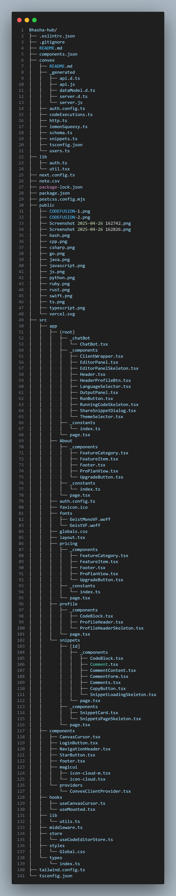

🗣️ Bhasha-Hub

📖 Project Description

**Bhasha-Hub** is a multilingual platform designed to connect people across different languages, allowing seamless communication and interaction.  
The motivation behind building this project was to address the gap in platforms that truly support and prioritize language diversity, especially for users who prefer native languages over English.  
**Bhasha-Hub** empowers users by providing an intuitive interface where they can easily switch between languages, access localized content, and feel included irrespective of their language preference.

I built this project to practice and showcase my skills in responsive web design, multi-language handling, and dynamic UI/UX adaptation across devices. It solves the problem of language barriers in web applications by offering an accessible, user-friendly, and responsive experience tailored for both desktop and mobile views.

Throughout the development, I learned a lot about:
- Advanced responsive design strategies
- Dynamic component rendering based on viewport
- Managing complex UI layouts for multilingual applications
- Improving user experience with adaptive navigation and mobile-first designs
- Balancing visual appeal and functionality across different screen sizes

---

## 📸 Screenshots

## 📸 Screenshots

### Desktop and Mobile Responsive Views


### Folder/Files Structure




---

## 🚀 Installation Instructions

### Prerequisites
- Node.js (v18 or higher)
- npm (v9 or higher) or yarn

### Steps to Run Locally

1. **Clone the Repository**
   ```bash
   git clone https://github.com/YOUR-USERNAME/bhasha-hub.git
   ```

2. **Navigate to the Project Directory**
   ```bash
   cd bhasha-hub
   ```

3. **Install Dependencies**
   ```bash
   npm install
   ```
   or
   ```bash
   yarn install
   ```

4. **Setup Environment Variables**  
   Create a `.env.local` file in the root of your project and add the following:

   ```env
   NEXT_PUBLIC_CLERK_PUBLISHABLE_KEY=your_clerk_publishable_key
   CLERK_SECRET_KEY=your_clerk_secret_key
   CONVEX_DEPLOYMENT=your_convex_deployment_url
   NEXT_PUBLIC_CONVEX_URL=your_public_convex_url
   GENERATIVE_AI_GEMNI_API=your_gemini_api_key
   ```

5. **Start the Development Server**
   ```bash
   npm run dev
   ```
   or
   ```bash
   yarn dev
   ```

6. **Open the App**  
   Visit [http://localhost:3000](http://localhost:3000) to see **Bhasha-Hub** in action!

---

# ✨ Thank you for checking out Bhasha-Hub!  
Feel free to contribute, suggest improvements, or simply give a ⭐ if you liked the project.
